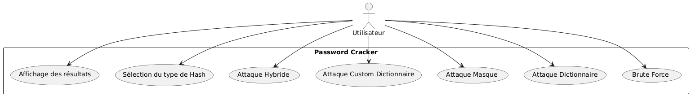
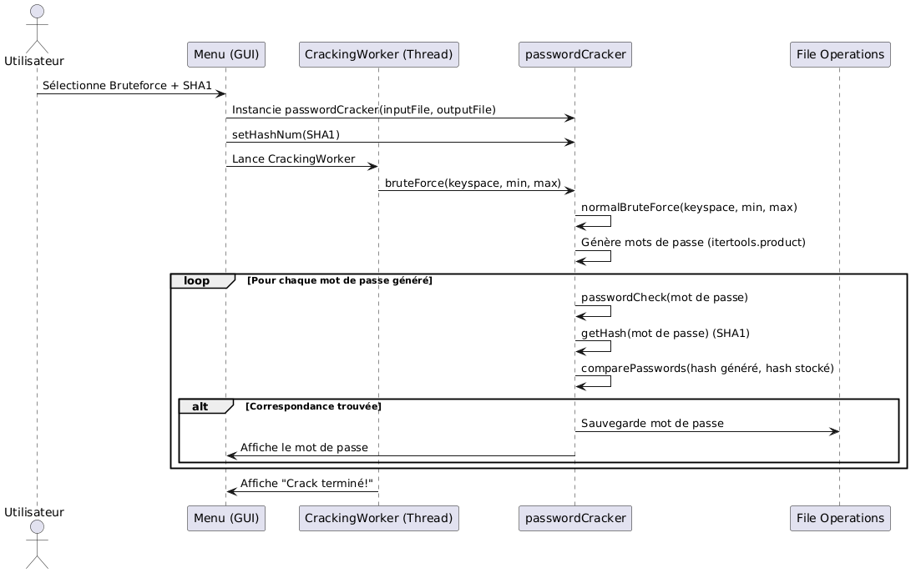
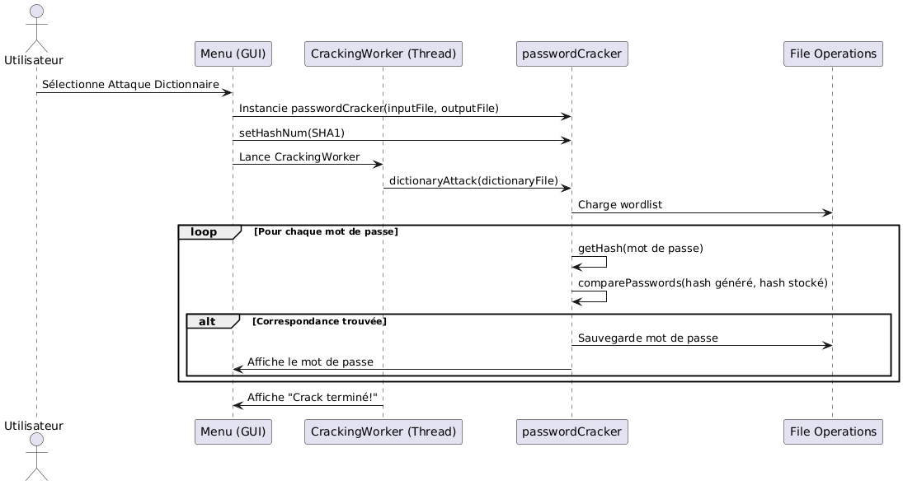
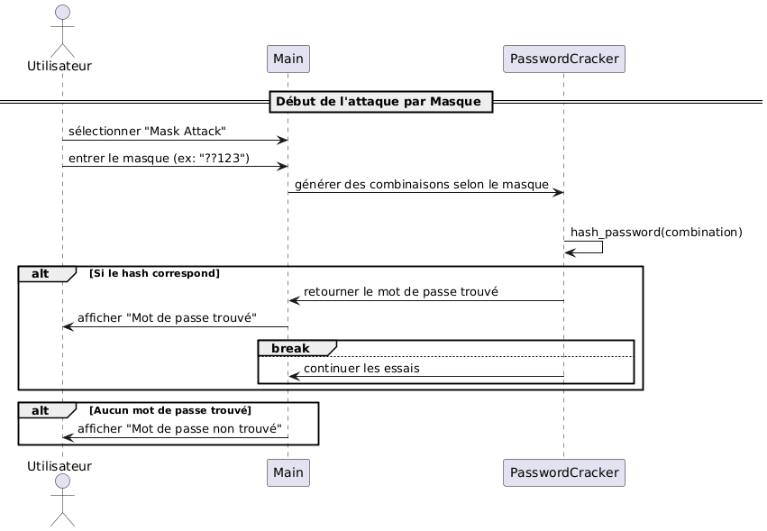
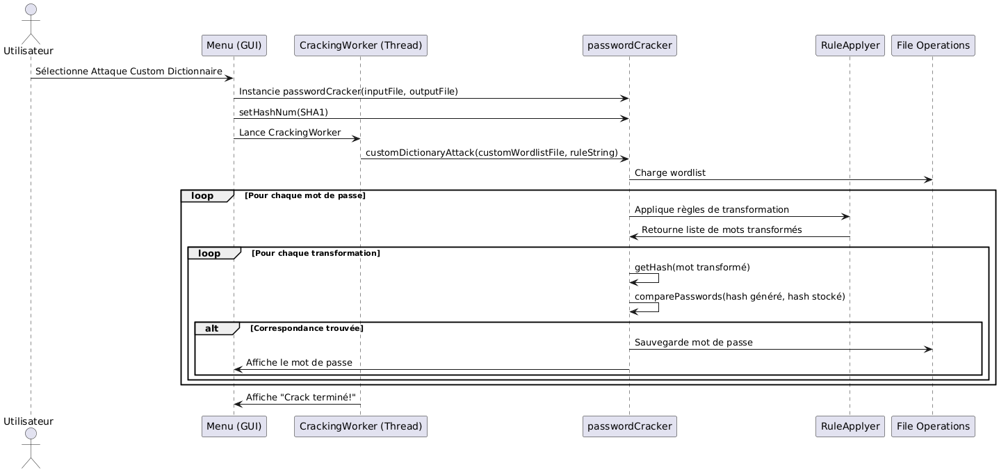

# 🛡️ **Password Cracker** — Outil de Test de Robustesse des Mots de Passe 🔐  

## 🚀 **Introduction**  

Bienvenue dans **Password Cracker**, un outil puissant développé dans le cadre d’une étude approfondie sur la sécurité des mots de passe. Ce projet a évolué d’un simple rapport théorique à un véritable outil de démonstration, permettant d’appliquer des techniques d'attaque de mots de passe pour sensibiliser à l’importance de choisir des mots de passe robustes.  

⚠️ **Important :** Cet outil est destiné uniquement à des fins éducatives et de test de sécurité sur vos propres systèmes. Toute utilisation abusive est strictement interdite.  

---

## ⚡ **Fonctionnalités Principales (Mode d’Emploi Détaillé)**  

L’outil propose plusieurs méthodes d'attaque de mots de passe, chacune adaptée à des besoins spécifiques. Voici une description détaillée des fonctionnalités :  

---

### 1️⃣ **Brute Force Attack** (Attaque par Force Brute)  

**Principe :**  
Cette attaque teste toutes les combinaisons possibles de caractères jusqu’à trouver le mot de passe correct. Elle est efficace mais peut être très longue selon la complexité du mot de passe.  

**Entrées nécessaires :**  
- 📄 **Fichier d’entrée :** Liste des mots de passe à craquer (peut contenir des mots de passe en clair ou des hachages).  
- 🔑 **Keyspace :** Ensemble des caractères à utiliser (lettres, chiffres, symboles…).  
- 🔢 **Longueur minimale et maximale :** Définit la plage de longueur des combinaisons à tester.  
- 🔐 **Type de Hash (facultatif) :** MD5, SHA1, bcrypt, ou aucun si en clair.  

**Sortie :**  
- ✅ Fichier de sortie contenant les mots de passe trouvés.  

**Exemple d’utilisation :**  
- Crackage d’un mot de passe simple avec un keyspace "abc123" et une longueur max de 4.  

---

### 2️⃣ **Dictionary Attack** (Attaque par Dictionnaire)  

**Principe :**  
Cette attaque compare les mots de passe à une liste prédéfinie de mots courants (comme le fameux fichier **rockyou.txt**). Elle est rapide si le mot de passe est courant.  

**Entrées nécessaires :**  
- 📄 **Fichier d’entrée :** Liste des mots de passe à craquer.  
- 📚 **Fichier dictionnaire :** Liste de mots à tester (comme rockyou.txt).  
- 🔐 **Type de Hash (si nécessaire).**  

**Sortie :**  
- ✅ Fichier de sortie avec les mots de passe trouvés.  

**Exemple :**  
- Utilisation de **rockyou.txt** pour tester des mots de passe faibles.  

> 🔗 *Note :* Le fichier rockyou.txt n'est pas inclus. Vous pouvez le télécharger [ici](https://github.com/brannondorsey/naive-hashcat/releases/download/data/rockyou.txt).  

---

### 3️⃣ **Custom Dictionary Attack** (Attaque par Dictionnaire Personnalisé)  

**Principe :**  
Vous partez d’une petite liste de mots (comme des noms ou des dates) et l’outil génère des variations en appliquant des **règles de transformation**. Cela permet d’élargir le dictionnaire pour des attaques plus ciblées.  

**Entrées nécessaires :**  
- 📄 **Fichier d’entrée :** Liste des mots de passe à craquer.  
- 🗒️ **Fichier de base :** Liste de mots de base (ex : "President", "Maman").  
- 🔄 **Règles de transformation :** Exemples :  
  - `u` → Met en majuscules.  
  - `r` → Inverse le mot.  
  - `d` → Duplique le mot.  
  - `ul` → Majuscules + minuscules.  

**Sortie :**  
- ✅ Fichier avec les mots de passe trouvés.  

**Exemple :**  
- À partir de `President`, `Maman`, appliquer les règles `ur` génère `TNEDISERP`, `NAMAM`.  

---

### 4️⃣ **Mask Attack** (Attaque par Masque)  

**Principe :**  
Idéal pour des mots de passe partiellement connus. Vous définissez un **modèle (masque)** où certains caractères sont fixes et d’autres variables.  

**Symboles courants :**  
- `?l` → Lettre minuscule (a–z)  
- `?u` → Lettre majuscule (A–Z)  
- `?d` → Chiffre (0–9)  
- `?s` → Caractère spécial  

**Entrées nécessaires :**  
- 📄 **Fichier d’entrée :** Mots de passe à craquer.  
- 🎭 **Masque :** Exemple `?u?l?l?d` (Majuscule, 2 minuscules, 1 chiffre).  
- 🔐 **Type de Hash (si besoin).**  

**Sortie :**  
- ✅ Fichier des mots de passe trouvés.  

**Exemple :**  
- Masque `?u?l?d?d` peut générer des combinaisons comme `Pa12`, `Te34`.  

---

### 5️⃣ **Hybrid Attack** (Attaque Hybride)  

**Principe :**  
Combine plusieurs méthodes pour une efficacité maximale. L’ordre est optimisé pour économiser du temps et des ressources :  
1. **Dictionary Attack (avec rockyou.txt)**  
2. **Custom Dictionary Attack (avec règles)**  
3. **Mask Attack**  
4. **Brute Force Attack** (en dernier recours)  

**Entrées nécessaires :**  
- 📄 **Fichier d’entrée**  
- 📚 **Dictionnaire**  
- 🗒️ **Custom Wordlist**  
- 🔄 **Règles de transformation**  
- 🎭 **Masque**  
- 🔐 **Type de Hash**  

**Sortie :**  
- ✅ Fichier avec tous les mots de passe trouvés.  

**Exemple :**  
- Cracker des mots de passe complexes avec un mix de toutes les techniques.  

---


## 📂 **Structure du Dossier**  

L’organisation du projet est conçue pour être claire et intuitive, facilitant la navigation entre les différents composants. Voici la structure du dépôt :  

```bash
Password-Cracking/
├── 📁 Rapport/                   # Rapport d’étude sur la sécurité des mots de passe
│   ├── password-security.md      # Version Markdown du rapport
│   └── password-security.pdf     # Version PDF du rapport  
│
├── 📁 Resources/                 # Ressources pour le projet
│   ├── references.md             # Références utilisées dans le projet
│   ├── tools.md                  # Outils recommandés pour la gestion des mots de passe
│   └── wordlists.md              # Informations sur les listes de mots courants
│
├── 📁 Code/                      # Cœur du projet : l'outil Password Cracker
│   ├── CreatCharacter.py         # Générateur de caractères personnalisés
│   ├── RuleApplyer.py            # Application des règles de transformation des mots
│   ├── generate_test_files.py    # Générateur de fichiers de test
│   ├── main.py                   # Interface graphique principale de l’outil
│   ├── passwordCracker.py        # Logique de crackage des mots de passe
│   ├── requirements.txt          # Dépendances Python pour le projet
│   │
│   ├── 📁 Input/                 # Dossier pour les fichiers d'entrée
│   ├── 📁 Output/                # Dossier pour les fichiers de sortie
│   ├── 📁 Resources/             # Ressources pour le projet possibilité de caractères
│   │   ├── digits.txt             
│   │   ├── letters_digits.txt         
│   │   ├── letters_digits_punctuations.txt         
│   │   ├── lowercases.txt        
│   │   ├── lowercases_digit.txt         
│   │   ├── lowercases_uppercases.txt        
│   │   ├── punctuation.txt         
│   │   ├── uppercases.txt         
│   │   └── uppercases_digits.txt
│   │
│   ├── 📁 diagrams/              # Diagrammes UML expliquant le fonctionnement de l’outil
│   │   ├── usecase/              # Diagrammes de cas d’utilisation
│   │   ├── class/                # Diagrammes de classes
│   │   ├── object/               # Diagrammes d’objets
│   │   └── sequences/            # Diagrammes de séquence pour différents scénarios
│   │
│   └── 📁 hash/                  # Scripts de hachage
│       ├── md5_hasher.py         # Convertisseur de texte en hash MD5
│       ├── sha1_hasher.py        # Convertisseur de texte en hash SHA1
│       └── bcrypt_hasher.py      # Convertisseur de texte en hash bcrypt
│
└── README.md                     # Documentation principale du projet
```

---

### 🗂️ **Description des Dossiers Importants :**  

- **`Rapport/` :** Contient le rapport original sur la sécurité des mots de passe.  
- **`Resources/` :** Fichiers de référence (listes de mots, outils recommandés, etc.).  
- **`Code/` :** Dossier principal de l'outil Password Cracker. Vous y trouverez tout le code source, les scripts de hachage, et les ressources nécessaires au fonctionnement de l'outil.  
- **`Input/` & `Output/` :** Dossiers dédiés aux fichiers d’entrée et de sortie générés lors des attaques.  
- **`diagrams/` :** Diagrammes UML expliquant l'architecture logicielle et les flux d'attaque.  
- **`hash/` :** Scripts pour générer des valeurs de hachage à partir de mots de passe en clair.  

---

### 🚩 **Points Clés à Retenir :**  

- Les **fichiers d'entrée** doivent être placés dans le dossier `Input/` (bien que vous puissiez sélectionner n'importe quel fichier depuis l'interface).  
- Les **résultats des attaques** seront automatiquement enregistrés dans le dossier `Output/`.  
- Le dossier `Resources/` est essentiel pour les attaques par masque et les keyspaces personnalisés.  

---

## 🖥️ **Utilisation de l’Outil Graphique (GUI)**  

L'outil **Password Cracker** dispose d'une interface graphique conviviale développée avec **PyQt5**, facilitant l'exécution des différentes attaques de crackage de mots de passe. Cette interface permet de configurer facilement les paramètres des attaques sans avoir à manipuler directement le code source.  

---

### 🚀 **Lancement de l’Outil**  

1. Assurez-vous d’avoir installé les dépendances nécessaires (Python et PyQt5).  
2. Ouvrez un terminal dans le dossier `Code/`.  
3. Exécutez la commande suivante :  
   ```bash
   python main.py
   ```  
4. L'interface graphique s’ouvrira, prête à être utilisée.  

---

### 🗂️ **Présentation de l’Interface**  

L'interface est divisée en plusieurs sections principales :  

#### 1️⃣ **Sélection du Mode d’Attaque**  
Vous pouvez choisir parmi les différentes méthodes d'attaque :  
- **Brute Force** 🔐  
- **Dictionnaire** 📚  
- **Custom Dictionnaire (avec règles)** ⚙️  
- **Mask Attack** 🎭  
- **Hybride (Full Attack)** ⚡  

Chaque option active des paramètres spécifiques pour configurer l’attaque.  

#### 2️⃣ **Configuration des Paramètres**  
- **Fichier d’Entrée** 📥 : Liste des mots de passe à craquer (en clair ou hachés).  
- **Fichier de Sortie** 📤 : Fichier où les résultats seront enregistrés.  
- **Type de Hash** 🔑 :  
  - Aucun (pour des mots de passe en clair)  
  - MD5  
  - SHA1  
  - bcrypt  
- **Keyspace** 🔢 : Sélection d’un ensemble de caractères prédéfinis.  
- **Longueur Minimale / Maximale** 📏 : Définit la longueur des mots à générer lors des attaques par force brute.  
- **Fichier Dictionnaire** 📜 : Liste de mots de passe pour les attaques par dictionnaire.  
- **Custom Wordlist** 📝 : Fichier personnalisé pour appliquer des règles de transformation.  
- **Règles de Transformation** 🛠️ : Applique des modifications aux mots de passe (ex : `ulr` pour Uppercase + Lowercase + Reverse).  
- **Masque (Mask Attack)** 🎭 : Définissez des modèles comme `?u?l?d` (lettre majuscule, lettre minuscule, chiffre).  

---

### ▶️ **Démarrer l’Attaque**  
Après avoir configuré les paramètres :  
1. Cliquez sur le bouton **“Démarrer l’attaque”**.  
2. L’outil affichera les progrès dans la zone de résultats.  
3. Une fois terminé, les mots de passe trouvés seront enregistrés dans le fichier de sortie spécifié.  

---

### 📝 **Exemple d’Utilisation**  

#### 🔐 **Brute Force :**  
- **Entrée :** `Input/hashes.txt`  
- **Sortie :** `Output/cracked_passwords.txt`  
- **Type de Hash :** MD5  
- **Keyspace :** Lettres (a-z)  
- **Longueur :** Min 4, Max 6  
- ✅ Résultat : Affichage des mots de passe trouvés dans l’interface et sauvegarde dans le fichier de sortie.  

#### 📚 **Attaque par Dictionnaire :**  
- **Fichier Dictionnaire :** `Resources/rockyou.txt`  
- **Entrée :** Liste de mots de passe hachés (MD5)  
- ✅ Résultat : Les mots de passe correspondant aux hashs sont identifiés.  

#### 🎭 **Mask Attack :**  
- **Masque :** `?u?l?d` (Majuscule, minuscule, chiffre)  
- **Exemple :** Génère des combinaisons comme `A1b`, `B9z`, etc.  
- ✅ Résultat : Recherche efficace si vous connaissez le format du mot de passe.  

#### ⚡ **Hybride (Full Attack) :**  
- Combine toutes les techniques (dictionnaire + masque + brute force).  
- **Idéal pour des attaques complexes où le mot de passe est difficile à deviner.**  

---

### ⚠️ **Conseils pour Optimiser l’Utilisation :**  
- **Utilisez des dictionnaires pertinents** pour accélérer les attaques.  
- **Précisez des masques** si vous avez des indices sur le format du mot de passe.  
- **Évitez les attaques par brute force sur des mots de passe très longs** (coût en ressources élevé).  

---

## 🎯 **Exemples d'Attaques Pratiques**  

Pour mieux comprendre le fonctionnement de **Password Cracker**, voici des scénarios d’attaques illustrant l’utilisation des différentes méthodes disponibles. Chaque exemple décrit la configuration des paramètres, le déroulement de l'attaque, ainsi que les résultats attendus.  

---

### 🔐 **1. Attaque par Force Brute (Brute Force Attack)**  

**Objectif :** Trouver un mot de passe simple inconnu à partir de toutes les combinaisons possibles.  

- **Fichier d’entrée :** `Input/hashes.txt` (contient des mots de passe hachés en MD5)  
- **Fichier de sortie :** `Output/cracked_passwords.txt`  
- **Type de hash :** MD5  
- **Keyspace :** Lettres minuscules (`a-z`)  
- **Longueur minimale :** 4  
- **Longueur maximale :** 6  

**Exécution :**  
1. Sélectionnez le mode **Brute Force**.  
2. Chargez le fichier d’entrée.  
3. Définissez le type de hash sur **MD5**.  
4. Sélectionnez le keyspace : `abcdefghijklmnopqrstuvwxyz`.  
5. Définissez la longueur entre 4 et 6 caractères.  
6. Cliquez sur **Démarrer l’attaque**.  

**Résultat attendu :**  
- Le programme génère toutes les combinaisons possibles de 4 à 6 caractères.  
- Une fois le mot de passe trouvé, il est affiché et enregistré dans le fichier de sortie.  

---

### 📚 **2. Attaque par Dictionnaire (Dictionary Attack)**  

**Objectif :** Trouver des mots de passe à partir d’une liste de mots courants.  

- **Fichier d’entrée :** `Input/hashes.txt`  
- **Fichier de sortie :** `Output/dictionary_results.txt`  
- **Fichier dictionnaire :** `Resources/rockyou.txt` (vous pouvez le télécharger [ici](https://github.com/brannondorsey/naive-hashcat/releases/download/data/rockyou.txt))  
- **Type de hash :** SHA1  

**Exécution :**  
1. Sélectionnez le mode **Dictionnaire**.  
2. Importez le fichier d’entrée contenant les hashs.  
3. Sélectionnez **SHA1** comme type de hash.  
4. Chargez le dictionnaire `rockyou.txt`.  
5. Lancez l’attaque.  

**Résultat attendu :**  
- Le programme compare chaque mot du dictionnaire aux hashs.  
- Les correspondances sont enregistrées dans le fichier de sortie.  

**💡 Astuce :** L’attaque par dictionnaire est efficace contre des mots de passe simples ou courants.  

---

### 🛠️ **3. Attaque par Dictionnaire Personnalisé (Custom Dictionary Attack)**  

**Objectif :** Générer un dictionnaire personnalisé à partir d’une petite liste de mots, en y appliquant des règles de transformation.  

- **Fichier d’entrée :** `Input/hashes.txt`  
- **Fichier de sortie :** `Output/custom_results.txt`  
- **Custom Wordlist :** `Input/custom_list.txt` (ex : `President`, `pere`, `Maman`)  
- **Règles de transformation :** `ur` (Uppercase + Reverse)  
- **Type de hash :** Aucun (mots de passe en clair)  

**Exécution :**  
1. Choisissez le mode **Custom Dictionnaire**.  
2. Importez le fichier de mots de base `custom_list.txt`.  
3. Entrez la règle `ur` dans le champ des règles.  
4. Lancez l’attaque.  

**Exemple de transformation avec la règle `ur` :**  
- `President` → `TNEDISERP`  
- `pere` → `EREP`  
- `Maman` → `NAMAM`  

**Résultat attendu :**  
- Le programme teste toutes les variations générées à partir des règles.  
- Les résultats sont affichés et sauvegardés.  

---

### 🎭 **4. Attaque par Masque (Mask Attack)**  

**Objectif :** Craquer un mot de passe en utilisant un masque définissant la structure du mot de passe.  

- **Fichier d’entrée :** `Input/hashes.txt`  
- **Fichier de sortie :** `Output/mask_results.txt`  
- **Masque :** `?u?l?l?d`  
  - `?u` → Lettre majuscule  
  - `?l` → Lettre minuscule  
  - `?d` → Chiffre  
- **Type de hash :** MD5  

**Exécution :**  
1. Sélectionnez le mode **Mask Attack**.  
2. Importez le fichier d’entrée.  
3. Entrez le masque `?u?l?l?d` dans le champ prévu.  
4. Sélectionnez **MD5** comme type de hash.  
5. Cliquez sur **Démarrer l’attaque**.  

**Exemple de mots générés :**  
- `Abc4`  
- `Xyz9`  
- `Po5k`  

**Résultat attendu :**  
- Le programme teste toutes les combinaisons correspondant au masque.  
- Les mots de passe trouvés sont enregistrés dans le fichier de sortie.  

---

### ⚡ **5. Attaque Hybride (Hybrid Attack - Full Attack)**  

**Objectif :** Effectuer une attaque combinée utilisant plusieurs techniques : dictionnaire, transformations de règles, masques, et brute force.  

- **Fichier d’entrée :** `Input/hashes.txt`  
- **Fichier de sortie :** `Output/hybrid_results.txt`  
- **Fichier dictionnaire :** `Resources/rockyou.txt`  
- **Custom Wordlist :** `Input/custom_list.txt`  
- **Règles :** `uld` (Uppercase + Lowercase + Duplicate)  
- **Masque :** `?u?l?d`  
- **Type de hash :** bcrypt  

**Exécution :**  
1. Sélectionnez le mode **Hybride (Full Attack)**.  
2. Importez le fichier d’entrée et sélectionnez **bcrypt**.  
3. Chargez le fichier dictionnaire `rockyou.txt`.  
4. Importez la liste personnalisée `custom_list.txt`.  
5. Définissez la règle `uld`.  
6. Entrez le masque `?u?l?d`.  
7. Cliquez sur **Démarrer l’attaque**.  

**Processus de l'attaque :**  
1. Tentative avec le dictionnaire `rockyou.txt`.  
2. Application des règles de transformation sur la custom wordlist.  
3. Tentatives basées sur le masque `?u?l?d`.  
4. En dernier recours, brute force si nécessaire.  

**Résultat attendu :**  
- L’attaque s’arrête dès que tous les mots de passe sont trouvés.  
- Résultats affichés dans l’interface et sauvegardés dans le fichier de sortie.  

---

### 📊 **Résumé des Résultats**  

| **Type d'Attaque**      | **Efficacité**                  | **Complexité**   | **Temps de Traitement** |
|:-------------------------|:--------------------------------|:-----------------|:------------------------|
| Brute Force              | Universelle, mais lente         | Élevée           | Long pour des mots longs |
| Dictionnaire             | Rapide sur des mots courants    | Faible           | Court                   |
| Custom Dictionnaire      | Très efficace avec des règles   | Moyenne          | Variable                |
| Mask Attack              | Optimisée si masque précis      | Moyenne          | Court à moyen           |
| Hybride (Full Attack)    | La plus complète                | Très élevée      | Long, mais optimisé     |

---

## **📊 Explications des Diagrammes UML**

### **1️⃣ Diagramme de Cas d’Utilisation (Use Case)**

#### 📌 **Objectif :**  
Ce diagramme montre les **interactions** entre l’utilisateur et le système. Il représente **les différents scénarios d'utilisation** du programme.  

#### 📌 **Explication :**  
- **L’utilisateur** peut choisir entre **différentes méthodes d’attaque** :  
  - 🔥 **Brute Force** : Génération de toutes les combinaisons possibles.  
  - 📖 **Dictionnaire** : Teste des mots de passe d’une wordlist.  
  - 🛠 **Custom Dictionnaire** : Applique des règles sur une wordlist pour générer de nouveaux mots.  
  - 🎭 **Masque** : Génère des mots de passe suivant un modèle défini.  
  - 🧬 **Hybride** : Combine toutes les méthodes pour maximiser l’efficacité.  
- **L’utilisateur** interagit avec l’interface **PyQt5**, qui contrôle la logique du `passwordCracker`.  
- Le système gère les fichiers **(input/output, dictionnaire, masques, etc.)**.  

---

### **2️⃣ Diagramme de Classe**

#### 📌 **Objectif :**  
Ce diagramme détaille **les classes, leurs attributs et méthodes, ainsi que leurs relations**.  

#### 📌 **Explication :**  
- La **classe `passwordCracker`** gère **toutes les attaques** et l’application des règles.  
- La **classe `Menu`** (interface graphique) contrôle **les interactions utilisateur**.  
- La **classe `CrackingWorker`** permet **d’exécuter les attaques en parallèle** pour ne pas bloquer l’interface.  
- La **classe `RuleApplyer`** applique **des transformations sur les mots de passe** dans les attaques par règles.  
- La **classe `CreatCharacter`** génère **les keyspaces et masques pour les attaques**.  

Chaque méthode est représentée avec **son rôle précis**, permettant de comprendre comment **le code est structuré**.  

---

### **3️⃣ Diagrammes de Séquence**

Ces diagrammes expliquent **comment les fonctions interagissent entre elles** pour chaque type d'attaque.  

#### **📌 Séquence 1 : Attaque Brute Force**

- L’interface (`Menu`) **lance une attaque brute force**.  
- `passwordCracker.bruteForce()` **génère toutes les combinaisons possibles** et les teste une par une.  
- Chaque mot de passe est **haché avec SHA1/MD5/Bcrypt** et comparé aux mots de passe stockés.  
- **Si une correspondance est trouvée**, elle est enregistrée et affichée.  
- **Si aucun mot de passe ne correspond**, l’attaque continue jusqu’à épuisement des possibilités.  

#### **📌 Séquence 2 : Attaque par Dictionnaire**

- `passwordCracker.dictionaryAttack()` **charge une wordlist** et teste chaque mot de passe.  
- Chaque mot est **haché et comparé** avec les mots de passe cibles.  
- **Si une correspondance est trouvée, le mot de passe est enregistré.**  
- **L’attaque s’arrête si tous les mots de passe sont trouvés ou si la wordlist est épuisée.**  

#### **📌 Séquence 3 : Attaque par Masque**

- `passwordCracker.maskAttack()` génère **des mots de passe selon un modèle défini** (`?u?l?d`).  
- Il teste **toutes les combinaisons possibles** à partir des caractères définis.  
- **Chaque mot généré est comparé aux mots de passe stockés** jusqu’à trouver une correspondance.  

#### **📌 Séquence 4 : Attaque Custom Dictionnaire**

- `passwordCracker.customDictionaryAttack()` applique **des règles de transformation** aux mots d’un dictionnaire.  
- **Exemple :** "password" peut devenir "p@ssw0rd" selon les règles définies.  
- Il teste ensuite les mots transformés **comme une attaque dictionnaire**.  

---


## 🚀 **Fonctionnalités Avancées et Perspectives d’Évolution**  

**Password Cracker** est conçu pour être extensible. Voici quelques fonctionnalités avancées prévues ou à venir :  

1. **Optimisation des Performances**  
   - Amélioration de la gestion des ressources pour des attaques plus rapides et efficaces.  
   - Utilisation de la parallélisation avancée (GPU cracking à venir).  

2. **Support d'Algorithmes de Hash Supplémentaires**  
   - Ajout d’algorithmes de hachage plus récents comme SHA-256, SHA-512, et Argon2.  

3. **Attaques sur les Réseaux Locaux (Future Extension)**  
   - Développement de modules pour le cracking des mots de passe Wi-Fi (WPA/WPA2).  
   - Analyse des vulnérabilités dans les réseaux locaux.  

4. **Personnalisation Avancée des Règles**  
   - Interface pour créer des règles complexes de transformation de mots de passe.  
   - Combinaison de plusieurs stratégies d'attaque de manière dynamique.  

5. **Tableaux de Bord et Statistiques**  
   - Visualisation des performances des attaques (vitesse, temps estimé, etc.).  
   - Suivi en temps réel des mots de passe trouvés.  

6. **Sécurité Renforcée pour l’Environnement de Test**  
   - Ajout de fonctionnalités de sécurité pour s'assurer que l'outil est utilisé à des fins éthiques uniquement.  
   - Intégration de modules de détection d’utilisation abusive.  

---


## ⚙️ **Installation**  

1️⃣ **Cloner le dépôt** :  
```bash
git clone https://github.com/Sunnoogo77/Password-Cracking.git
cd Password-Cracking/code
```

2️⃣ **Créer un environnement virtuel (recommandé)** :  
```bash
python -m venv venv
source venv/bin/activate  # Sur Linux/macOS
# ou
venv\Scripts\activate     # Sur Windows
```

3️⃣ **Installer les dépendances** :  
```bash
pip install -r requirements.txt
```

4️⃣ **Lancer l'application** :  
```bash
python main.py
```

---

## 🚨 **Avertissement Éthique**  
Cet outil est développé à des **fins éducatives** uniquement.  
L’utilisation de cet outil à des fins malveillantes est **strictement interdite**.  
Assurez-vous de l’utiliser dans un cadre légal, éthique et contrôlé.  


### 📌 **Inspirations du Projet**  

Ce projet s’inspire d’un outil de cracking de mots de passe existant, découvert lors de mes recherches initiales sur la sécurité des mots de passe.  
**Cependant, l’objectif n’était pas de reproduire, mais de comprendre, améliorer et étendre les fonctionnalités existantes.**  


Ce dépôt représente **ma propre version**, développée et affinée après plusieurs tests et ajustements.  


## 📩 **Contact**  
Pour toute question, suggestion ou collaboration, contactez-moi via [GitHub](https://github.com/Sunnoogo77).  